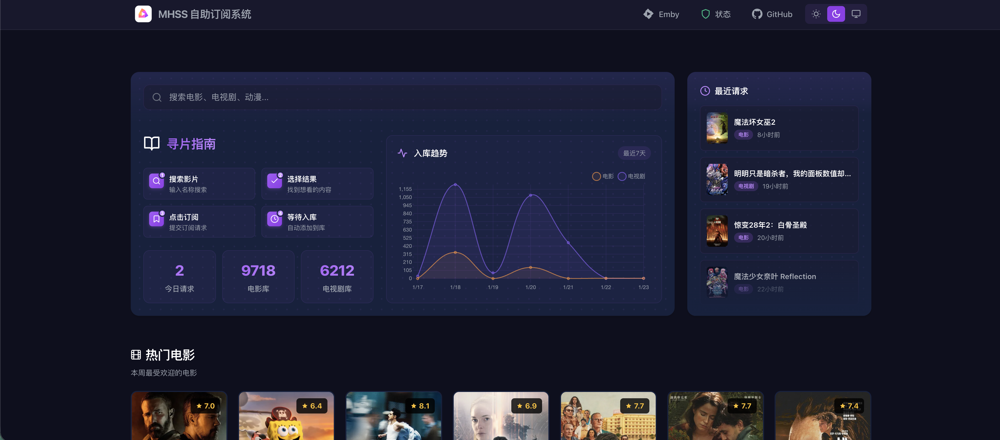
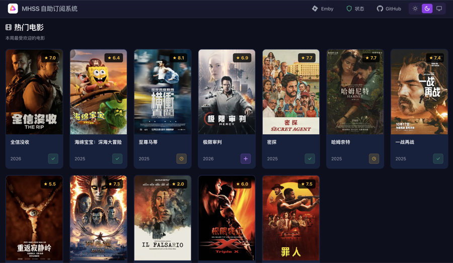
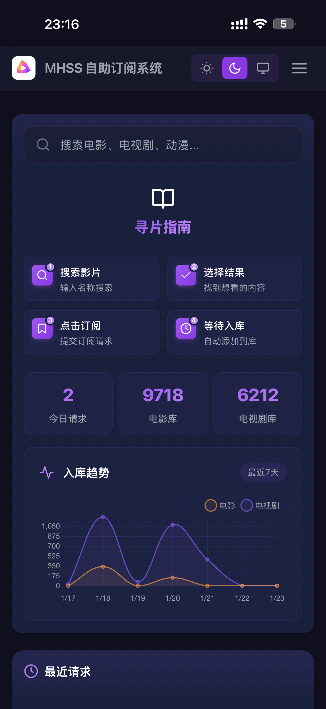

# MHSS - MediaHelp 自助订阅系统

一个基于 MediaHelp 的自助求片网站，用户可以搜索影片并自动在 MediaHelp 上创建订阅。

## 项目截图

### PC端



### 移动端
 

## 功能特点

- 🔍 集成 TMDB API，实时搜索影视剧
- 🤖 自动在 MediaHelp 上创建订阅
- 🔐 Emby 账号登录认证
- 📊 显示热门电影和电视剧
- 📱 完全响应式设计，支持移动端
- 💾 记录已请求的影片，避免重复请求
- 📈 支持 Emby 库统计展示
- 🎨 深色/浅色主题切换

## 快速开始

### 1. 安装依赖

```bash
npm install
```

### 2. 配置环境变量

复制 `.env.example` 为 `.env`，并填写以下信息：

```env
# TMDB API Key（必需）- 从 https://www.themoviedb.org/settings/api 获取
TMDB_API_KEY=你的TMDB_API_KEY

# Emby 配置（必需）- 用于登录认证
EMBY_URL=你的Emby服务器地址
EMBY_API_KEY=你的Emby_API_KEY

# MediaHelp 配置（必需）- 用于创建订阅
MEDIAHELP_URL=你的MediaHelp地址
MEDIAHELP_USERNAME=你的MediaHelp用户名
MEDIAHELP_PASSWORD=你的MediaHelp密码

# 服务器端口（可选）
PORT=3000
```

### 3. 启动服务

```bash
npm start
```

访问 http://localhost:3000

### 4. 开发模式

支持热重载：

```bash
npm run dev
```

访问 http://localhost:3001

## Docker 部署

### 使用 Docker Compose（推荐）

1. 克隆仓库：
```bash
git clone https://github.com/mps233/MHSS.git
cd MHSS
```

2. 编辑 `docker-compose.yml`，填写环境变量：
```yaml
environment:
  - TMDB_API_KEY=你的TMDB_API_KEY
  - EMBY_URL=你的Emby服务器地址
  - EMBY_API_KEY=你的Emby_API_KEY
  - MEDIAHELP_URL=你的MediaHelp地址
  - MEDIAHELP_USERNAME=你的MediaHelp用户名
  - MEDIAHELP_PASSWORD=你的MediaHelp密码
  - PORT=3000
```

3. 启动容器：
```bash
docker-compose up -d
```

4. 访问 http://localhost:3000

### 使用预构建镜像

```bash
docker run -d \
  --name mhss \
  -p 3000:3000 \
  -e TMDB_API_KEY=你的TMDB_API_KEY \
  -e EMBY_URL=你的Emby服务器地址 \
  -e EMBY_API_KEY=你的Emby_API_KEY \
  -e MEDIAHELP_URL=你的MediaHelp地址 \
  -e MEDIAHELP_USERNAME=你的MediaHelp用户名 \
  -e MEDIAHELP_PASSWORD=你的MediaHelp密码 \
  miaona/mhss:latest
```

## 配置说明

### TMDB API Key
1. 访问 https://www.themoviedb.org/settings/api
2. 注册账号并申请 API Key
3. 将 API Key 填入 `TMDB_API_KEY`

### Emby 配置
1. `EMBY_URL`: Emby 服务器地址，例如 `http://192.168.1.100:8096`
2. `EMBY_API_KEY`: 在 Emby 设置 -> API 密钥中生成

### MediaHelp 配置
1. `MEDIAHELP_URL`: MediaHelp 服务器地址
2. `MEDIAHELP_USERNAME`: MediaHelp 登录用户名
3. `MEDIAHELP_PASSWORD`: MediaHelp 登录密码

**注意**：系统会自动使用 MediaHelp 的默认配置（云盘类型、目录、定时任务等），无需额外配置。

## 使用说明

1. 使用 Emby 账号登录
2. 在搜索框中输入影片名称
3. 点击搜索结果中的 ➕ 按钮订阅
4. 系统会自动在 MediaHelp 上创建订阅任务

## 技术栈

- **后端**: Node.js + Express
- **前端**: 原生 JavaScript + CSS
- **API**: TMDB API, Emby API, MediaHelp API
- **部署**: Docker

## 开源协议

MIT License

## 贡献

欢迎提交 Issue 和 Pull Request！

## 致谢

- [TMDB](https://www.themoviedb.org/) - 提供影片数据
- [Emby](https://emby.media/) - 媒体服务器
- [MediaHelp](https://github.com/tymdun/MediaHelp) - 自动化订阅工具
